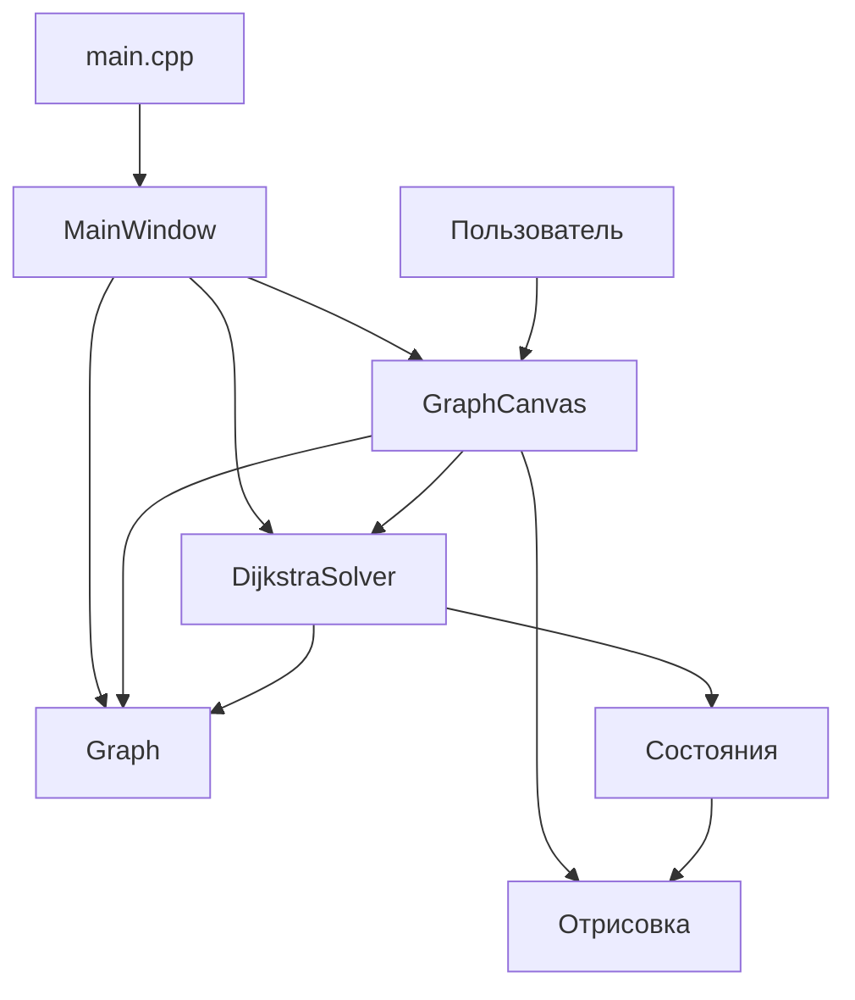

# Архитектура проекта «Визуализатор алгоритма Дейкстры»

## Обзор

Проект представляет собой интерактивное приложение на C++/Qt для визуализации алгоритма Дейкстры поиска кратчайших путей во взвешенном неориентированном графе. Приложение позволяет пользователю создавать графы в графическом редакторе, выбирать стартовую вершину и пошагово наблюдать за работой алгоритма с цветовой подсветкой состояний вершин и рёбер.

Основная цель архитектуры — разделение модели графа, алгоритма, отрисовки и пользовательского интерфейса для обеспечения гибкости, тестируемости и лёгкой модификации.

## Компоненты системы

### 1. Модель графа (Graph, Vertex, Edge)

**Graph** — центральный класс, представляющий граф как совокупность вершин и рёбер. Отвечает за:
- Хранение списков вершин (`m_vertices`) и рёбер (`m_edges`).
- Генерацию уникальных идентификаторов вершин (`m_nextVertexId`).
- Добавление/удаление вершин и рёбер с проверкой корректности.
- Предоставление смежных рёбер для заданной вершины.
- Генерацию случайного графа в заданной области.

**Vertex** — класс вершины графа. Содержит:
- Уникальный целочисленный идентификатор (`m_id`).
- Координаты на холсте (`m_position`).
- Метку для отображения (`m_label`).

**Edge** — класс ребра графа. Содержит:
- Указатели на начальную и конечную вершины (`m_from`, `m_to`).
- Вес ребра (`m_weight`).
- Позицию для отрисовки метки веса (`m_labelPos`) и флаг пользовательской позиции.

Модель графа не зависит от Qt-визуализации и может использоваться в чисто вычислительных задачах.

### 2. Алгоритмический движок (DijkstraSolver)

**DijkstraSolver** — реализация алгоритма Дейкстры с поддержкой пошагового выполнения и детальной визуализации состояний.

#### Ключевые особенности:
- Работает с внешним объектом `Graph` (композиция).
- Поддерживает два набора состояний:
  - **Состояния вершин**: `VS_WHITE` (недостижима), `VS_ORANGE` (в очереди), `VS_YELLOW` (обрабатывается), `VS_GREEN` (финализирована).
  - **Состояния рёбер**: `ES_WHITE` (не рассмотрено), `ES_ORANGE` (в очереди), `ES_YELLOW` (рассматривается), `ES_GREEN` (в дереве кратчайших путей), `ES_RED` (отвергнуто).
- Внутреннее состояние включает:
  - Расстояния до каждой вершины (`m_distances`).
  - Предшественники для восстановления путей (`m_predecessors`).
  - Приоритетную очередь вершин (`m_priorityQueue`).
  - Текущую обрабатываемую вершину (`m_currentVertex`).
- Алгоритм выполняется пошагово методом `step()`, который разбит на две подфазы:
  1. **Релаксация и применение правил визуализации** (подшаг 0).
  2. **Выбор следующей вершины для обработки** (подшаг 1).
- Правила визуализации (обозначенные в коде как «Правило 1», «Правило 3.1» и т.д.) определяют, как изменяются цвета вершин и рёбер на каждом шаге, чтобы отразить логику алгоритма.

### 3. Визуализатор (GraphCanvas)

**GraphCanvas** — наследник `QWidget`, отвечающий за отрисовку графа и обработку пользовательского ввода.

#### Ответственности:
- **Отрисовка**: методы `drawVertex()` и `drawEdge()` рисуют вершины и рёбра с учётом их состояний (цвета берутся из `DijkstraSolver`).
- **Взаимодействие**: обработка событий мыши и клавиатуры для создания/удаления вершин и рёбер, перетаскивания, выбора стартовой вершины и т.д.
- **Режимы работы**: `Normal`, `AddVertex`, `AddEdge`, `SetStart`, `DragVertex`, `DragWeight` — определяют поведение при кликах.
- **Координация с алгоритмом**: вызов `stepDijkstra()` для выполнения очередного шага, обновление холста после каждого шага.

GraphCanvas не содержит логики алгоритма, а лишь отображает состояние, предоставляемое `DijkstraSolver`.

### 4. Пользовательский интерфейс (MainWindow)

**MainWindow** — главное окно приложения, построенное на `QMainWindow`.

#### Элементы интерфейса:
- **GraphCanvas** — центральный виджет.
- **Панель кнопок**: «Установить старт», «Запуск», «Шаг», «Сброс», «Случайный граф».
- **Таблица расстояний** (`QTableWidget`) — показывает текущие расстояния до всех вершин.
- **Статусная строка** — отображает текущий режим и состояние алгоритма.
- **Таймер** (`QTimer`) — для автоматического пошагового выполнения с анимацией.

MainWindow координирует работу всех компонентов: создаёт граф и решатель, соединяет сигналы кнопок со слотами, обновляет таблицу расстояний и статус.

### 5. Точка входа (main.cpp)

Создаёт экземпляры `Graph`, `DijkstraSolver`, `GraphCanvas` и `MainWindow`, связывает их и запускает главный цикл Qt.

## Взаимодействие компонентов



### Поток данных при выполнении алгоритма:

1. Пользователь нажимает кнопку «Шаг» в MainWindow.
2. MainWindow вызывает `GraphCanvas::stepDijkstra()`.
3. GraphCanvas вызывает `DijkstraSolver::step()`.
4. DijkstraSolver выполняет одну итерацию алгоритма, обновляет внутренние расстояния и состояния.
5. GraphCanvas запрашивает у DijkstraSolver состояния вершин и рёбер через `getVertexState()` и `getEdgeState()`.
6. GraphCanvas перерисовывает себя, используя эти состояния для выбора цветов.
7. MainWindow обновляет таблицу расстояний, запрашивая актуальные расстояния у DijkstraSolver.

### Поток данных при редактировании графа:

1. Пользователь кликает на холст в режиме добавления вершины.
2. GraphCanvas определяет координаты и вызывает `Graph::addVertex()`.
3. Graph обновляет свой список вершин и возвращает новую вершину.
4. GraphCanvas обновляет отображение и, если необходимо, уведомляет DijkstraSolver о сбросе (так как граф изменился).

## Детали реализации алгоритма

### Пошаговое выполнение

Алгоритм Дейкстры реализован не как монолитная функция, а как конечный автомат с двумя подшагами:

- **Подшаг 0 (релаксация)**:
  - Находится текущая жёлтая вершина (если есть).
  - Выполняется релаксация её смежных рёбер: обновляются расстояния до соседей.
  - Применяются правила визуализации:
    - Правило 1: жёлтые вершина и рёбра становятся зелёными.
    - Правило 3.1: рёбра, инцидентные жёлтой вершине, становятся оранжевыми.
    - Правило 3.2: вершины, соединённые новыми оранжевыми рёбрами, становятся оранжевыми.
    - Правило 4: оранжевые рёбра, соединяющие зелёную и жёлтую вершины, становятся красными.
- **Подшаг 1 (выбор следующей вершины)**:
  - Из всех оранжевых вершин выбирается та, у которой минимальное расстояние.
  - Она становится жёлтой (текущей для следующей итерации).
  - Если оранжевых вершин нет, алгоритм завершается (`m_finished = true`).

Такое разделение позволяет визуализировать каждый этап алгоритма отдельно, что улучшает педагогический эффект.

### Управление состояниями

DijkstraSolver хранит два набора состояний: текущий (`m_vertexState`, `m_edgeState`) и предыдущий (`m_oldVertexState`, `m_oldEdgeState`). Это нужно для корректного применения правил визуализации, которые часто ссылаются на «старое» состояние вершины или ребра (например, «если вершина была жёлтой, стань зелёной»).

## Визуализация и цветовая схема

Цвета вершин и рёбер определяются их состоянием:

| Объект | Состояние | Цвет | Описание |
|--------|-----------|------|----------|
| Вершина | VS_WHITE | Светло-серый | Не достигнута, расстояние бесконечно |
| Вершина | VS_ORANGE | Оранжевый | В очереди на обработку (временное расстояние) |
| Вершина | VS_YELLOW | Жёлтый | Обрабатывается на текущем шаге |
| Вершина | VS_GREEN | Зелёный | Финализирована, кратчайшее расстояние найдено |
| Ребро | ES_WHITE | Чёрный/белый (в зависимости от фона) | Никогда не рассматривалось |
| Ребро | ES_ORANGE | Оранжевый | В очереди на рассмотрение |
| Ребро | ES_YELLOW | Жёлтый | Рассматривается на текущем шаге (релаксация) |
| Ребро | ES_GREEN | Зелёный | Входит в дерево кратчайших путей |
| Ребро | ES_RED | Красный | Рассмотрено и отвергнуто (не войдёт в дерево) |

Цвет обычных рёбер (ES_WHITE) адаптируется к фону: на светлом фоне — чёрный, на тёмном — белый (метод `getEdgeNormalColor()`).

## Обработка пользовательского ввода

GraphCanvas поддерживает несколько режимов, переключаемых через панель инструментов или горячие клавиши:

- **Normal**: выделение вершин (клик), удаление (Delete), перетаскивание вершины (зажатие и движение).
- **AddVertex**: клик на холсте создаёт новую вершину.
- **AddEdge**: последовательный выбор двух вершин создаёт ребро с запросом веса.
- **SetStart**: выбор вершины в качестве стартовой для алгоритма.
- **DragVertex**: перетаскивание вершины (аналогично Normal, но без предварительного выделения).
- **DragWeight**: перетаскивание метки веса ребра для удобного размещения.

Контекстное меню (ПКМ на вершине/ребре) предоставляет быстрые действия: удалить, изменить вес, сделать стартовой.

## Сборка и зависимости

Проект использует CMake для сборки. Зависимости:
- Qt6 Core и Widgets.
- Компилятор с поддержкой C++17.

Структура каталогов:
```
d:/Sirius/BFS_visual/
├── CMakeLists.txt
├── src/
│   ├── main.cpp
│   ├── MainWindow.h / .cpp
│   ├── GraphCanvas.h / .cpp
│   ├── Graph.h / .cpp
│   ├── Vertex.h / .cpp
│   ├── Edge.h / .cpp
│   └── DijkstraSolver.h / .cpp
├── architecture.md (этот файл)
├── README.md
└── test_*.cpp (юнит-тесты)
```

## Тестирование

В проекте присутствуют два тестовых приложения:
- `test_dijkstra.cpp` — проверяет корректность алгоритма на заранее заданных графах.
- `test_spec.cpp` — проверяет соответствие спецификации визуализации (правила смены цветов).

Тесты собираются в отдельные исполняемые файлы и могут быть запущены независимо от основного приложения.

## Возможные улучшения архитектуры

1. **Выделение интерфейсов** — абстрагирование Graph и DijkstraSolver позволило бы подменять реализации (например, для других алгоритмов).
2. **Модель-Представление-Контроллер** — можно отделить модель графа от представления (GraphCanvas) более строго, используя паттерн Наблюдатель для уведомлений об изменениях.
3. **Плагины визуализации** — поддержка разных цветовых схем и стилей отрисовки через конфигурационные файлы.
4. **Сериализация графа** — сохранение и загрузка графа из файла (JSON, XML).
